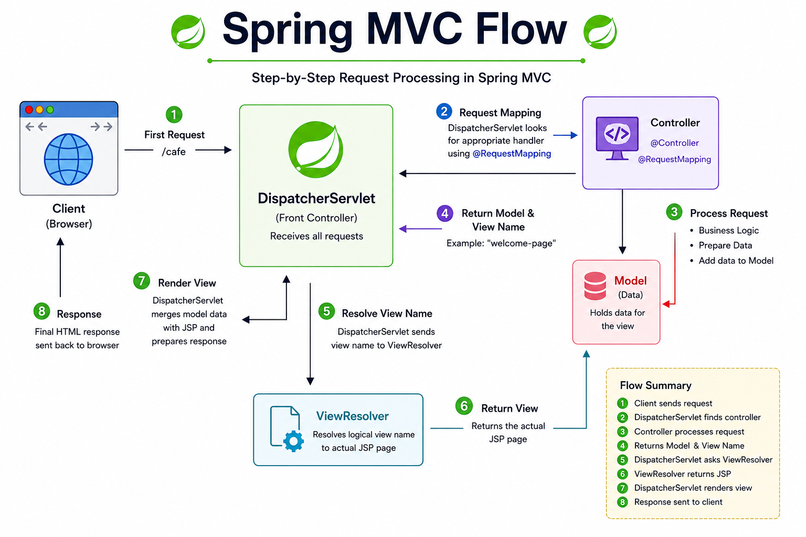
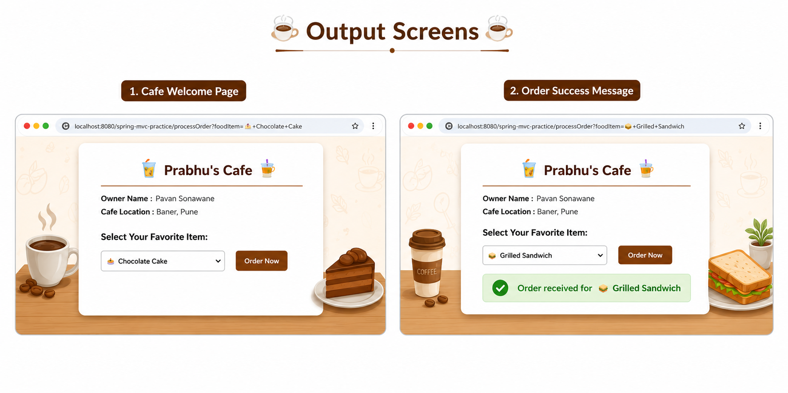

# ☕ Spring MVC Practice 🚀

Project built using XML configuration, Controllers, JSP Views, and View Resolver.

This project demonstrates the core concepts of Spring MVC architecture including request handling, controller mapping, form processing, and dynamic JSP rendering through a mini cafe ordering module.

---

## ⚙️ What This Covers

✔ Spring MVC XML Configuration  
✔ DispatcherServlet Setup  
✔ View Resolver Configuration  
✔ Multiple Controllers & Request Mappings  
✔ Class-Level `@RequestMapping`  
✔ Sending Data from Controller to View  
✔ Dynamic JSP Rendering  
✔ Cafe Order Form Processing  
✔ Success Message Card with Auto Hide  
✔ Form Handling using `HttpServletRequest`

---

## 🛠️ How It Works

| Component / Feature | Description |
|-------------------|-------------|
| `DispatcherServlet` | Handles all incoming requests |
| `@Controller` | Defines Spring MVC controller classes |
| `@RequestMapping` | Maps URLs to controller methods |
| `Model` | Sends data from controller to JSP |
| `View Resolver` | Resolves logical view names to JSP pages |
| `HttpServletRequest` | Reads form request data |
| `welcome-page.jsp` | Displays dynamic cafe UI and order details |
| `processOrder()` | Processes selected cafe item and returns response |

 

---

## 🎯 Conclusion

👉 *This repository provides a practical understanding of Spring MVC architecture and demonstrates how Spring handles request processing, controller mapping, view resolution, and dynamic JSP rendering using XML configuration.*

---

⭐ Thank You for Visiting This Repository ⭐

